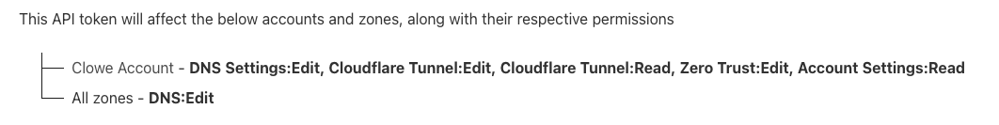

# Infrastructure

Infra is controlled using OpenTofu (Terraform).

- Cloudflare docs https://registry.terraform.io/providers/cloudflare/cloudflare/latest/docs
  - Authenticate by setting the `CLOUDFLARE_API_TOKEN` environment variable
  - Need a Cloudflare Token with the following permissions 
