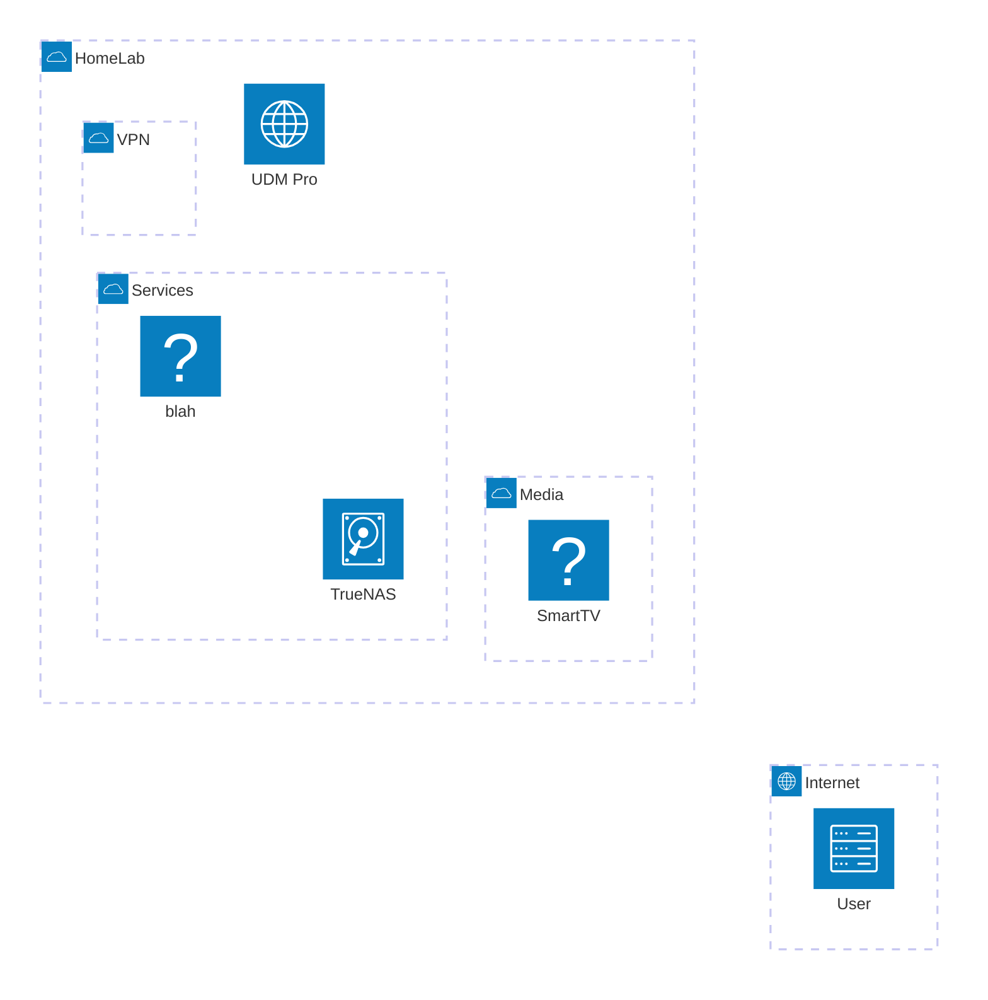

# Network Setup

```mermaid
architecture-beta

    group internet(internet)[Internet]
    group homelab(cloud)[HomeLab]
    group media(cloud)[Media] in homelab
    group services(cloud)[Services] in homelab
    group vpn(cloud)[VPN] in homelab

    service user(server)[User] in internet
    service smartTv(logos:100tb)[SmartTV] in media
    service udmpro(internet)[UDM Pro] in homelab
    service truenas(disk)[TrueNAS] in services
    service thing(mdi:ab-testing)[blah] in services

```
